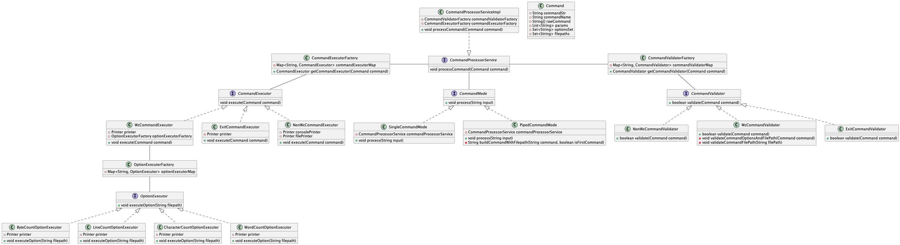

# wc-command-line-tool
Simple command line tool - wc - cloned using java

## Existing Functionality
1. Works for both relative and absolute paths
2. Validates whether path provided is a file or not
3. Exit command for exiting safely
4. Added support for pipe command mode - Supports any number of pipes but with `wc` as terminal command
5. Supports multiple options at once, both at a time
   and separated by spaces (like `{-cl}` and `{-cl -m}`)
6. Supports multiple files at once
7. Works for file paths with spaces, enclosed in quotes (`{", '}`)

## TODO
1. Multiple char-sets to be supported

## Diagrams
1. Class Diagram
